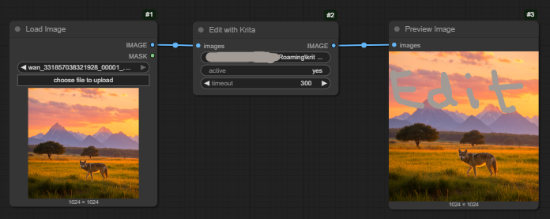

# Edit in Krita

Often in my inpainting workflows I want to make a small edit manually, to nudge the inpaint in the right direction.

So I created this node that will open the image in Krita, and when you save it, pass it on.

It's a great companion to [Image Filter](https://github.com/chrisgoringe/cg-image-filter).

---

## Installation

### Install Krita if you don't have it

- [krita.org](https://krita.org/)

### Install the custom node

With the Comfy Manager, or manually:

```bash
cd [...]/ComfyUI/custom_nodes
git clone https://github.com/chrisgoringe/cg-krita
```

Restart ComfyUI

### Copy the Krita files

- In Krita, go to the `Settings` menu and select `Manage Resources`. Then click the `Open Resource Folder` button.
- A file navigator window (or the equivalent in your OS) will open. In that folder, find the subfolder `pykrita`.
- Copy the folder `wait_and_open` and the file `wait_and_open.desktop` (from the krita_files subdirectory) into the `pykrita` subfolder.
- Make a note of the full path of the folder you just copied - on windows it will probably be something like

`C:\Users\[name]\AppData\Roaming\krita\pykrita\wait_and_open`

- Restart Krita
  - If you look in the `wait_and_open` directory, you should now see a file called `log.txt` has been created

---

## Usage

- Put the `Edit with Krita` node into your workflow where you want to edit an image.
  - The `directory` widget needs to specify the full path of the folder you found above. If you are using windows it will
probably be correct by default. See below for how to set the default folder if you need to.
  - The timeout specifies a timeout, after which the original image will be passed through.
  - The active field can be used to dynamically enable/disable the node. It's a `STRING` input; if it is *empty*, the node
will just pass the image through; if it contains anything at all, the node will run.
- Make sure Krita is running on your computer
- Run the workflow
- The image will load in Krita.
  - If Krita isn't running, the workflow will just wait. When you launch Krita, the image will open.
- Make the edits you want, and save. When you save, the image will close in Krita, and the workflow resume.
  - Note that you need to make a change, however trivial, for Comfy to resume before the timeout. The node checks the modification time.
- If you sent a batch of images, they will each open in turn.



---

## Setting the default directory

If your `wait_and_open` folder isn't correct by default, you can specify the default the node should used by
saving a file `default.txt` in `custom_nodes/cg-krita`, the first line of which is the default value you want to use.

See `default_example.txt` for details.

---

## Deeper changes

There are a couple of parameters that you are unlikely to want to change, but might...

### OS pad time

In `edit_with_krita.py` there is a parameter `PAD_TIME`. This is a time (in seconds) that the node will wait
to ensure that the filesystem has completed operations (so we don't try to load a file Krita is still saving).

If you have problems with files not seeming synced, you could try increasing it.

### Krita extension sleep time

In `wait_and_open.py` (in the Krita resources, at `...krita\pykrita\wait_and_open\wait_and_open.py`) there is a 
parameter `SLEEP`. This is how long Krita waits between checks to see if there is a file for it to open.

### Krita extension close on save

In `wait_and_open.py` (in the Krita resources, at `...krita\pykrita\wait_and_open\wait_and_open.py`) there is a 
parameter `CLOSE_ON_SAVE`. Maybe you want the image to stay open after you save it?
