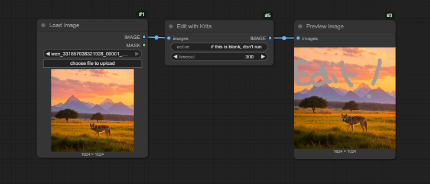

# Edit in Krita



Often in my inpainting workflows I want to make a small edit manually, to nudge the inpaint in the right direction.
So I created this node that will open the image in Krita, and when you save it, pass it on.

It's a great companion to [Image Filter](https://github.com/chrisgoringe/cg-image-filter).

## Installation

### Install Krita if you don't have it

- [krita.org](https://krita.org/)

### Install the custom node

With the Comfy Manager, or manually:

```bash
cd [...]/ComfyUI/custom_nodes
git clone https://github.com/chrisgoringe/cg-krita
```

Restart ComfyUI

## Usage

- Put the `Edit with Krita` node into your workflow where you want to edit an image.
  - The timeout specifies a timeout, after which the original image will be passed through.
  - The active field can be used to dynamically enable/disable the node. It's a `STRING` input; if it is *empty*, the node
will just pass the image through; if it contains anything at all, the node will run.
- Make sure Krita is running on your computer
- Run the workflow
- The image will load in Krita.
  - If Krita isn't running, the workflow will just wait. When you launch Krita, the image will open.
- Make the edits you want, and save. When you save, the image will close in Krita, and the workflow resume.
  - Note that you need to make a change, however trivial, for Comfy to resume before the timeout. The node checks the modification time.
- If you sent a batch of images, they will each open in turn.

## Problems?

Try [here](docs/trouble.md) first. Then [report an issue](./issues)

## Ideas?

[Raise an issue](./issues)